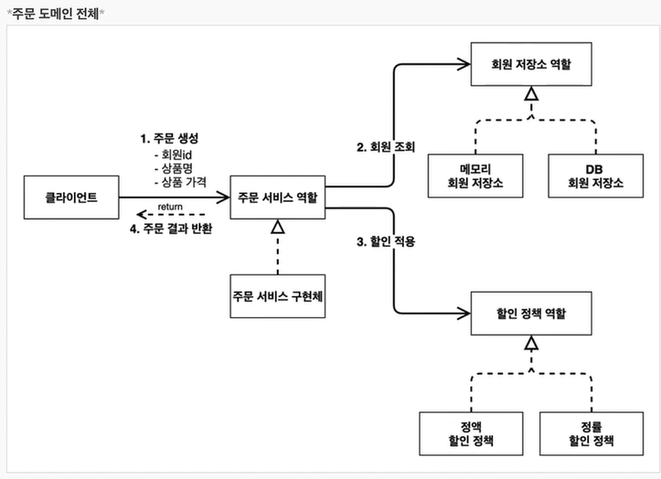
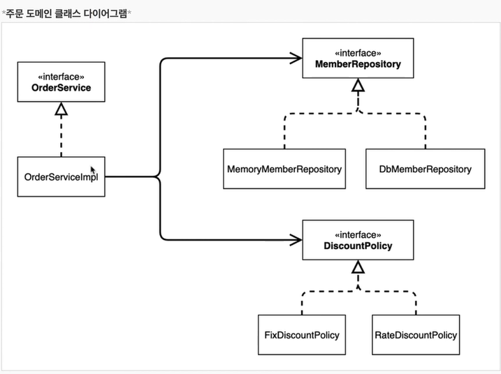

회원 도메인 요구사항 
- 회원을 가압히고 조회할 수 있다
- 회원응ㄴ 일반과 vip 등급이 있다.
- 회원 데이터는 자체 db를 구축할 수 있고 외부와 연동할 수 있다.

주문과 할인정책
- 회원은 상품을 주문할 수 있다.
- 회원 등급에 따라 할인 정책을 적용할 수 있다.
- 할인 정책은 모든  vip는 1000 원할인 고정금액.
- 할인 정책은 변경 가능성이 높다. 

역할과 구현을 분리하는 설계

